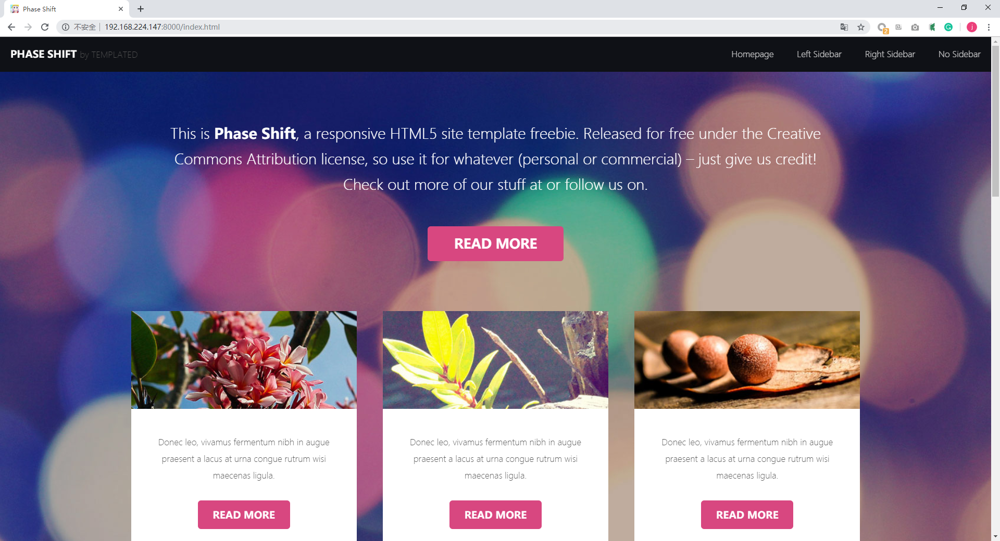

## 一、安装依赖

	sudo apt-get install cmake 
    sudo apt-get install libboost-dev libboost-test-dev

## 二、运行
	./build 
    cd ../http_build/debug/bin
    ./httpServer_test
    
输入你的服务器IP和端口，我这里是

> http://192.168.224.147:8000/

回车可见：

